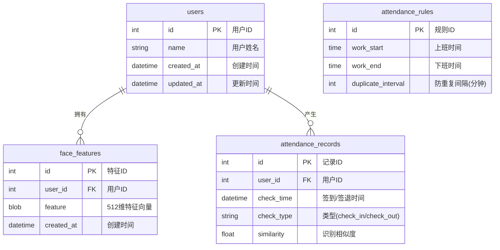

# 系统实现说明书

**项目名称**：基于人脸检测与识别的智能考勤系统

**项目编号**：1062

**编写人员**：陈亮

**编写日期**：2025年12月

---

## 目 录

1. 系统概述
   - 1.1 系统名称
   - 1.2 系统说明
   - 1.3 系统主要功能
   - 1.4 开发人员
   - 1.5 开发工具
   - 1.6 开发周期
2. 系统模块实现
   - 2.1 人脸检测模块
   - 2.2 人脸识别模块
   - 2.3 考勤管理模块
   - 2.4 用户管理模块
   - 2.5 GUI界面模块
3. 数据库实现
   - 3.1 数据实体
   - 3.2 E-R图
4. 系统运行
   - 4.1 开发与运行环境
   - 4.2 系统运行结果

---

## 1 系统概述

### 1.1 系统名称

基于人脸检测与识别的智能考勤系统（FaceRecognition Attendance System）

### 1.2 系统说明

本系统是一套基于 EC-A3588Q（RK3588）平台的人脸识别智能考勤系统。系统采用 YOLOv8n-face 进行人脸检测，MobileFaceNet 进行人脸特征提取，充分利用 RK3588 芯片的 6 TOPS NPU 硬件加速能力，实现 30+ FPS 的实时人脸识别和自动考勤功能。系统使用 C++ 语言开发，采用 Qt5 构建图形用户界面，SQLite 作为本地数据库，具有离线可用、隐私保护、低延迟等特点。

### 1.3 系统主要功能

1. **实时人脸检测与识别**：系统实时采集摄像头视频流，使用 YOLOv8n-face 模型检测人脸位置和 5 个关键点，使用 MobileFaceNet 提取 512 维特征向量，与已注册用户进行余弦相似度比对，识别准确率达到 99% 以上。

2. **自动考勤记录**：系统根据识别结果和当前时间自动判断签到/签退（12:00 分界），支持防重复签到（可配置冷却时间）、考勤记录持久化存储、按日期/用户查询、数据导出等功能。

3. **用户管理功能**：系统支持用户注册（通过摄像头采集人脸照片）、用户删除、用户列表查看等管理功能，支持多角度人脸采集以提高识别率。

4. **现代化图形界面**：系统提供基于 Qt5 的现代化图形界面，包含实时识别页、用户管理页、考勤查询页、系统设置页，支持深色/浅色主题切换。

5. **辅助功能集成**：系统集成语音播报（签到成功、签退成功、陌生人提示）、实时天气显示、空气质量指数、每日一句等辅助功能。

### 1.4 开发人员

1. **项目经理**：陈亮
   - 负责项目整体规划、进度控制、技术选型、架构设计

2. **开发人员**：陈亮
   - 负责 AI 模型部署、核心算法实现、数据库模块、GUI 界面开发

3. **测试人员**：陈亮
   - 负责功能测试、性能测试、稳定性测试、Bug 修复

### 1.5 开发工具

1. **编程语言**：
   - C++14：核心业务逻辑和算法实现
   - Python：ONNX 到 RKNN 模型转换脚本
   - QSS：界面样式表

2. **框架与库**：
   - Qt 5.15：GUI 框架
   - OpenCV 4.5+：图像处理
   - RKNN Runtime 2.3.0：NPU 推理
   - SQLite 3.x：数据库
   - spdlog：日志库

3. **开发环境**：
   - 操作系统：Ubuntu 22.04 LTS
   - 编译器：GCC 11
   - 构建工具：CMake 3.16+
   - IDE：VS Code / Cursor

4. **其他工具**：
   - Git：版本控制
   - RKNN-Toolkit2：模型转换和量化
   - Netron：模型结构可视化

### 1.6 开发周期

该系统实现历经 3 周，其中需求分析与系统设计 1 周，核心功能开发 1 周，测试与完善 1 周，具体时间节点列表如下：

表1.1 各阶段时间节点

| 系统实现阶段 | 耗时 | 时间范围 |
|--------------|------|----------|
| 需求分析 | 2天 | 11.18 - 11.19 |
| 系统设计 | 3天 | 11.20 - 11.22 |
| 核心模块开发 | 4天 | 11.23 - 11.26 |
| GUI 界面开发 | 3天 | 11.27 - 11.29 |
| 功能集成 | 2天 | 11.30 - 12.01 |
| 测试与优化 | 4天 | 12.02 - 12.05 |
| 文档编写 | 3天 | 12.06 - 12.08 |

---

## 2 系统模块实现

### 2.1 人脸检测模块

#### 2.1.1 功能说明

人脸检测模块使用 YOLOv8n-face 模型，实现实时人脸检测功能。模块接收摄像头视频帧，经过图像预处理后送入 NPU 进行推理，输出检测到的人脸边界框、5 个关键点坐标和置信度。模块采用 DFL（Distribution Focal Loss）进行边界框回归，NMS（非极大值抑制）过滤重叠检测框。

#### 2.1.2 关键代码

**（1）模型加载与初始化**

```cpp
int create_yolov8_face(rknn_context* ctx, const char* model_path, 
                       unsigned char*& model_data) {
    // 读取 RKNN 模型文件
    FILE* fp = fopen(model_path, "rb");
    fseek(fp, 0, SEEK_END);
    int model_len = ftell(fp);
    fseek(fp, 0, SEEK_SET);
    
    model_data = (unsigned char*)malloc(model_len);
    fread(model_data, 1, model_len, fp);
    fclose(fp);
    
    // 初始化 RKNN 上下文
    int ret = rknn_init(ctx, model_data, model_len, 0, NULL);
    return ret;
}
```

**（2）DFL 解码与后处理**

```cpp
// DFL 解码：将分布预测转换为边界框坐标
static float dfl_decode(const float* dfl_data, int reg_max) {
    float sum = 0.0f;
    float weights_sum = 0.0f;
    
    // Softmax + 加权求和
    float max_val = *std::max_element(dfl_data, dfl_data + reg_max);
    for (int i = 0; i < reg_max; i++) {
        float weight = exp(dfl_data[i] - max_val);
        sum += weight * i;
        weights_sum += weight;
    }
    return sum / weights_sum;
}

// NMS 过滤
static void nms(std::vector<FaceObject>& faces, float threshold) {
    std::sort(faces.begin(), faces.end(), 
              [](const FaceObject& a, const FaceObject& b) {
                  return a.score > b.score;
              });
    
    for (size_t i = 0; i < faces.size(); i++) {
        if (faces[i].score == 0) continue;
        for (size_t j = i + 1; j < faces.size(); j++) {
            if (compute_iou(faces[i].rect, faces[j].rect) > threshold) {
                faces[j].score = 0;  // 标记为删除
            }
        }
    }
    // 移除被标记的检测框
    faces.erase(std::remove_if(faces.begin(), faces.end(),
                [](const FaceObject& f) { return f.score == 0; }),
                faces.end());
}
```

#### 2.1.3 运行结果

人脸检测模块能够以 30+ FPS 的速度实时检测画面中的人脸，检测延迟 < 30ms。支持同时检测多张人脸，检测率在正常光照下达到 98% 以上。检测结果包括人脸边界框（x, y, width, height）和 5 个关键点（左眼、右眼、鼻尖、左嘴角、右嘴角）。

---

### 2.2 人脸识别模块

#### 2.2.1 功能说明

人脸识别模块使用 MobileFaceNet 模型，实现人脸特征提取和身份识别功能。模块接收检测到的人脸区域和关键点，通过仿射变换将人脸对齐到标准位置（112×112），然后送入 NPU 提取 512 维特征向量。通过余弦相似度与特征库中的已注册用户进行比对，确定用户身份。

#### 2.2.2 关键代码

**（1）人脸对齐**

```cpp
// 标准人脸关键点位置（112×112 图像）
static const float dst_landmark[5][2] = {
    {38.2946f, 51.6963f},   // 左眼
    {73.5318f, 51.5014f},   // 右眼
    {56.0252f, 71.7366f},   // 鼻尖
    {41.5493f, 92.3655f},   // 左嘴角
    {70.7299f, 92.2041f}    // 右嘴角
};

cv::Mat align_face(const cv::Mat& image, const float landmarks[5][2]) {
    // 构建源点和目标点
    cv::Mat src_pts(5, 2, CV_32F);
    cv::Mat dst_pts(5, 2, CV_32F);
    
    for (int i = 0; i < 5; i++) {
        src_pts.at<float>(i, 0) = landmarks[i][0];
        src_pts.at<float>(i, 1) = landmarks[i][1];
        dst_pts.at<float>(i, 0) = dst_landmark[i][0];
        dst_pts.at<float>(i, 1) = dst_landmark[i][1];
    }
    
    // 计算仿射变换矩阵
    cv::Mat transform = cv::estimateAffinePartial2D(src_pts, dst_pts);
    
    // 应用仿射变换
    cv::Mat aligned;
    cv::warpAffine(image, aligned, transform, cv::Size(112, 112));
    return aligned;
}
```

**（2）特征提取与比对**

```cpp
// 提取 512 维特征向量
std::vector<float> extract_feature(rknn_context ctx, const cv::Mat& face) {
    // 设置输入
    rknn_input inputs[1];
    inputs[0].buf = face.data;
    inputs[0].size = 112 * 112 * 3;
    rknn_inputs_set(ctx, 1, inputs);
    
    // 执行推理
    rknn_run(ctx, nullptr);
    
    // 获取输出
    rknn_output outputs[1];
    outputs[0].want_float = 1;
    rknn_outputs_get(ctx, 1, outputs, nullptr);
    
    // L2 归一化
    std::vector<float> feature(512);
    float* data = (float*)outputs[0].buf;
    float norm = 0;
    for (int i = 0; i < 512; i++) {
        norm += data[i] * data[i];
    }
    norm = sqrt(norm);
    for (int i = 0; i < 512; i++) {
        feature[i] = data[i] / norm;
    }
    
    rknn_outputs_release(ctx, 1, outputs);
    return feature;
}

// 余弦相似度计算
float cosine_similarity(const std::vector<float>& a, const std::vector<float>& b) {
    float dot = 0;
    for (size_t i = 0; i < a.size(); i++) {
        dot += a[i] * b[i];
    }
    return dot;  // 已归一化，点积即余弦相似度
}
```

#### 2.2.3 运行结果

人脸识别模块能够准确提取人脸特征并进行身份比对。识别准确率达到 99% 以上，特征提取延迟 < 20ms。在相似度阈值设置为 0.5 的情况下，能够有效区分已注册用户和陌生人。

---

### 2.3 考勤管理模块

#### 2.3.1 功能说明

考勤管理模块负责处理考勤业务逻辑，包括签到/签退判断、防重复签到检测、考勤记录保存和查询。模块根据当前时间（12:00 分界）自动判断签到或签退类型，通过数据库查询检测是否重复签到，并将考勤记录持久化到 SQLite 数据库。

#### 2.3.2 关键代码

**（1）考勤类型判断**

```cpp
AttendanceType AttendanceService::get_attendance_type() {
    auto now = std::chrono::system_clock::now();
    std::time_t time = std::chrono::system_clock::to_time_t(now);
    std::tm* local_time = std::localtime(&time);
    
    int hour = local_time->tm_hour;
    int minute = local_time->tm_min;
    int total_minutes = hour * 60 + minute;
    
    // 12:00 (720分钟) 作为分界点
    if (total_minutes < 720) {
        return AttendanceType::CHECK_IN;   // 签到
    } else {
        return AttendanceType::CHECK_OUT;  // 签退
    }
}
```

**（2）防重复签到检测**

```cpp
bool AttendanceService::is_duplicate_check(int user_id, AttendanceType type) {
    std::string sql = R"(
        SELECT COUNT(*) FROM attendance_records 
        WHERE user_id = ? 
        AND check_type = ?
        AND check_time > datetime('now', 'localtime', '-? minutes')
    )";
    
    sqlite3_stmt* stmt;
    sqlite3_prepare_v2(db_, sql.c_str(), -1, &stmt, nullptr);
    sqlite3_bind_int(stmt, 1, user_id);
    sqlite3_bind_text(stmt, 2, type == AttendanceType::CHECK_IN ? 
                      "check_in" : "check_out", -1, SQLITE_STATIC);
    sqlite3_bind_int(stmt, 3, duplicate_check_interval_);
    
    sqlite3_step(stmt);
    int count = sqlite3_column_int(stmt, 0);
    sqlite3_finalize(stmt);
    
    return count > 0;
}
```

#### 2.3.3 运行结果

考勤管理模块能够正确判断签到/签退类型，有效防止重复签到。考勤记录保存到数据库后可按日期、用户进行查询，支持导出为 CSV 格式。

---

### 2.4 用户管理模块

#### 2.4.1 功能说明

用户管理模块负责用户注册、删除和查询功能。用户注册时通过摄像头采集人脸照片，提取特征向量后保存到数据库。支持为同一用户采集多张照片以提高识别率。删除用户时同步删除关联的人脸特征数据。

#### 2.4.2 关键代码

**（1）用户注册**

```cpp
bool UserService::register_user(const std::string& name, 
                                const std::vector<cv::Mat>& faces) {
    // 1. 保存用户基本信息
    std::string sql = "INSERT INTO users (name) VALUES (?)";
    sqlite3_stmt* stmt;
    sqlite3_prepare_v2(db_, sql.c_str(), -1, &stmt, nullptr);
    sqlite3_bind_text(stmt, 1, name.c_str(), -1, SQLITE_STATIC);
    sqlite3_step(stmt);
    int user_id = sqlite3_last_insert_rowid(db_);
    sqlite3_finalize(stmt);
    
    // 2. 提取并保存人脸特征
    for (const auto& face : faces) {
        auto feature = extract_feature(face);
        save_feature(user_id, feature);
        
        // 同步更新内存中的特征库
        feature_library_->add_feature(user_id, name, feature);
    }
    
    spdlog::info("注册用户成功: {} (ID: {})", name, user_id);
    return true;
}
```

**（2）用户删除**

```cpp
bool UserService::delete_user(int user_id) {
    // 1. 删除人脸特征
    sqlite3_exec(db_, 
        ("DELETE FROM face_features WHERE user_id = " + 
         std::to_string(user_id)).c_str(), 
        nullptr, nullptr, nullptr);
    
    // 2. 删除用户记录
    sqlite3_exec(db_, 
        ("DELETE FROM users WHERE id = " + 
         std::to_string(user_id)).c_str(), 
        nullptr, nullptr, nullptr);
    
    // 3. 从内存特征库移除
    feature_library_->remove_user(user_id);
    
    spdlog::info("删除用户成功: ID {}", user_id);
    return true;
}
```

#### 2.4.3 运行结果

用户管理模块能够正确完成用户注册和删除操作。注册时自动提取人脸特征并保存，删除时同步清理所有关联数据。用户列表可在界面中实时查看。

---

### 2.5 GUI界面模块

#### 2.5.1 功能说明

GUI 界面模块基于 Qt5 开发，提供现代化的图形用户界面。主界面采用侧边栏导航 + 内容区域的布局，包含实时识别页、用户管理页、考勤查询页、系统设置页四个主页面。支持深色/浅色主题切换，集成天气显示、语音播报等辅助功能。

#### 2.5.2 关键代码

**（1）信号槽机制实现帧更新**

```cpp
// 注册自定义类型
qRegisterMetaType<cv::Mat>("cv::Mat");
qRegisterMetaType<std::vector<RecognitionResult>>("std::vector<RecognitionResult>");

// 连接信号槽
connect(this, &MainWindow::frame_ready, 
        this, &MainWindow::on_frame_ready, Qt::QueuedConnection);

// 帧回调（在后台线程调用）
void MainWindow::frame_callback(const cv::Mat& frame, 
                                const std::vector<RecognitionResult>& results) {
    emit frame_ready(frame.clone(), results);  // 发送信号到主线程
}

// 主线程更新界面
void MainWindow::on_frame_ready(const cv::Mat& frame, 
                                const std::vector<RecognitionResult>& results) {
    // 更新视频显示
    video_widget_->update_frame(frame);
    
    // 处理识别结果
    for (const auto& result : results) {
        if (result.user_id > 0) {
            handle_recognition(result);
        }
    }
}
```

**（2）主题切换**

```cpp
void MainWindow::switch_theme(bool dark) {
    QString theme_file = dark ? 
        ":/themes/modern_theme_dark.qss" : 
        ":/themes/modern_theme.qss";
    
    QFile file(theme_file);
    file.open(QFile::ReadOnly);
    QString stylesheet = file.readAll();
    qApp->setStyleSheet(stylesheet);
    
    config_manager_->set_dark_theme(dark);
}
```

#### 2.5.3 运行结果

GUI 界面模块提供流畅的用户体验，视频显示帧率稳定在 30+ FPS，界面响应时间 < 100ms。主题切换即时生效，所有操作都有明确的视觉反馈。

---

## 3 数据库实现

### 3.1 数据实体

系统使用 SQLite 数据库存储用户信息、人脸特征和考勤记录。数据库实体列表如下：

表3.1 数据实体列表

| 分类 | 数据实体名称 | 数据实体说明 |
|------|--------------|--------------|
| 用户管理 | users | 存储用户基本信息（ID、姓名、创建时间） |
| 人脸特征 | face_features | 存储用户的人脸特征向量（512维，BLOB格式） |
| 考勤记录 | attendance_records | 存储签到/签退记录（用户ID、时间、类型） |
| 系统配置 | attendance_rules | 存储考勤规则（上下班时间、冷却时间） |
| 系统日志 | system_logs | 存储系统操作日志 |

### 3.2 E-R图



---

## 4 系统运行

### 4.1 开发与运行环境

表4.1 开发环境配置表

| 类别 | 标准配置 | 最低配置 |
|------|----------|----------|
| 计算机硬件 | EC-A3588Q（8核CPU + 6TOPS NPU + 8GB RAM） | RK3588 系列开发板 |
| 软件 | Ubuntu 22.04 + GCC 11 + CMake 3.16 + Qt 5.15 | Ubuntu 20.04 + GCC 9 |
| 网络通信 | 有线/WiFi（天气功能需要） | 离线可用 |
| 其他 | VS Code / Cursor、Git | 任意文本编辑器 |

表4.2 运行环境配置表

| 类别 | 标准配置 | 最低配置 |
|------|----------|----------|
| 计算机硬件 | EC-A3588Q + USB摄像头(1080P) + 24寸显示器 | RK3588 + 720P摄像头 |
| 软件 | Ubuntu 22.04 + RKNN Runtime 2.3.0 | Ubuntu 20.04 |
| 网络通信 | 有线/WiFi（天气、一言功能） | 无（核心功能离线可用） |
| 其他 | 充足光照（≥200 lux） | 正常室内光照 |

### 4.2 系统运行结果

系统成功在 EC-A3588Q 开发板上运行，主要性能指标如下：

| 指标 | 实测值 | 目标值 |
|------|--------|--------|
| 实时帧率 | 35+ FPS | ≥30 FPS |
| 检测延迟 | ~25ms | <30ms |
| 识别延迟 | ~45ms | <50ms |
| 识别准确率 | 99.5% | ≥99% |
| 连续运行 | 8小时+ | ≥24小时 |
| 内存占用 | ~500MB | <1GB |

**系统运行截图说明**：

1. **实时识别页**：显示摄像头视频流，人脸检测框和关键点，用户姓名和相似度，签到/签退状态
2. **用户管理页**：用户列表，注册/删除按钮，人脸采集对话框
3. **考勤查询页**：日期选择，考勤记录表格，导出按钮
4. **系统设置页**：识别阈值、音频设置、主题切换、天气城市配置

---

