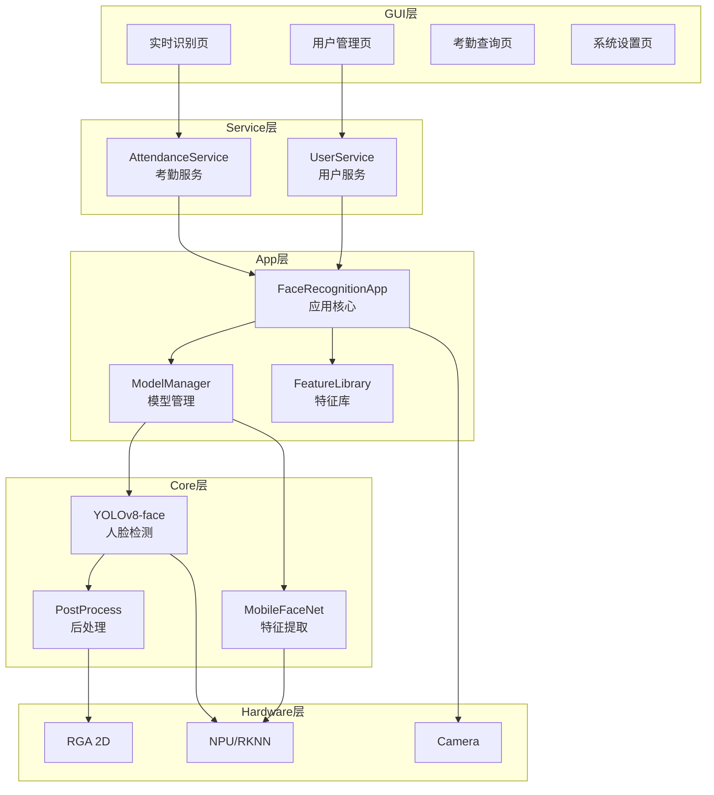
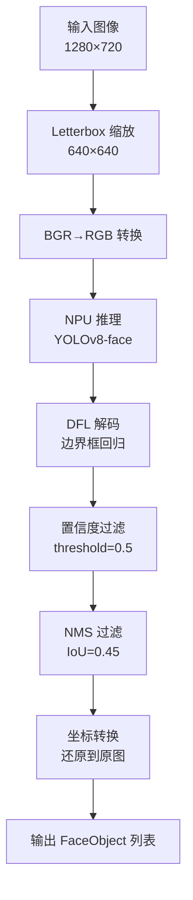
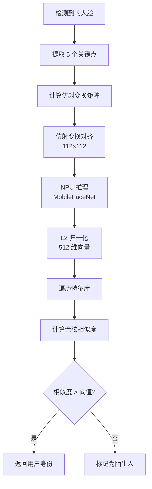
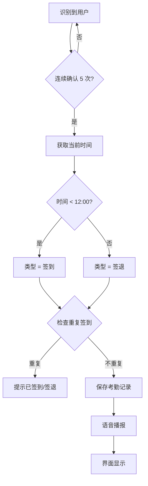
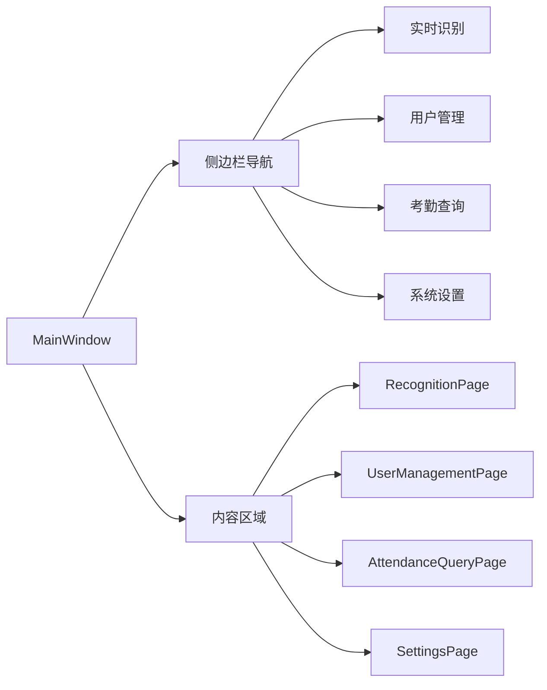
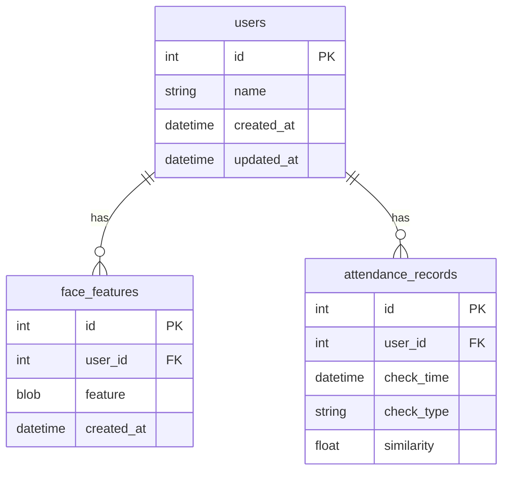

# 系统设计说明书

**项目名称**：基于人脸检测与识别的智能考勤系统

**项目编号**：1062

**编写人员**：陈亮

**编写日期**：2025年12月

---

## 目 录

1. 引言
   - 1.1 系统简述
   - 1.2 软件设计目标
   - 1.3 参考资料
   - 1.4 术语与缩写词
2. 规范和要求
   - 2.1 命名规则
   - 2.2 界面设计规范
   - 2.3 接口规范
3. 设计概述
   - 3.1 系统总体设计
   - 3.2 约束和假定
4. 系统模块设计
   - 4.1 人脸检测模块设计
   - 4.2 人脸识别模块设计
   - 4.3 考勤管理模块设计
   - 4.4 用户管理模块设计
   - 4.5 GUI界面模块设计
5. 接口设计
6. 数据库设计
   - 6.1 数据库设计概述
   - 6.2 数据库详细设计
7. 非功能性设计
8. 出错处理
9. 其他

---

## 1. 引言

### 1.1 系统简述

本系统是一套基于 EC-A3588Q（RK3588）平台的人脸识别智能考勤系统。系统采用 YOLOv8n-face 进行人脸检测，MobileFaceNet 进行人脸特征提取，充分利用 RK3588 芯片的 6 TOPS NPU 硬件加速能力，实现实时人脸识别和自动考勤功能。系统使用 C++ 语言开发，Qt5 构建图形界面，SQLite 作为本地数据库，具有离线可用、隐私保护、低延迟等特点。

### 1.2 软件设计目标

#### 1.2.1 系统功能目标

1. **实时人脸检测与识别**：系统能够实时采集摄像头视频流，使用深度学习模型检测人脸并提取特征，与已注册用户进行比对识别，识别准确率达到 99% 以上。

2. **自动考勤记录**：系统根据识别结果和当前时间自动判断签到/签退，记录考勤信息到数据库，支持防重复签到、考勤查询和数据导出功能。

3. **用户管理功能**：系统支持用户注册（人脸采集）、用户删除、用户列表查看等管理功能，支持多角度人脸采集以提高识别率。

4. **友好的图形界面**：系统提供现代化的 Qt5 图形界面，包含实时识别页、用户管理页、考勤查询页、系统设置页，支持深色/浅色主题切换。

5. **辅助功能集成**：系统集成语音播报、天气显示、每日一句等辅助功能，提升用户体验。

#### 1.3.1 非功能性目标

1. **高性能**：系统实时帧率达到 30+ FPS，人脸检测延迟 < 30ms，人脸识别延迟 < 50ms，界面响应时间 < 100ms，确保用户体验流畅。

2. **高稳定性**：系统能够连续运行 24 小时以上无崩溃，无内存泄漏，CPU 占用率 < 50%，保证长期稳定运行。

3. **高安全性**：系统遵循《个人信息保护法》，人脸特征以二进制格式存储，不存储原始照片，数据本地处理不上传云端，保护用户隐私。

### 1.3 参考资料

| 参考文档名称 | 作者 | 备注说明 |
|--------------|------|----------|
| 《计算机软件文档编制规范》 | 国标管理委员会 | GB/T8567-2006 |
| 《信息安全技术 个人信息安全规范》 | 国标管理委员会 | GB/T 35273-2020 |
| 《人脸识别数据安全要求》 | 国标管理委员会 | GB/T 41819-2022 |
| RKNN-Toolkit2 用户指南 | 瑞芯微 | 官方文档 |
| YOLOv8 官方文档 | Ultralytics | 模型参考 |
| Qt5 官方文档 | Qt Group | GUI 框架 |
| 《智能考勤系统需求分析说明书》 | 本项目组 | 需求文档 |

### 1.4 术语与缩写词

| 术语/缩写词 | 说明 |
|-------------|------|
| NPU | Neural Processing Unit，神经网络处理单元 |
| RKNN | Rockchip Neural Network，瑞芯微神经网络模型格式 |
| FPS | Frames Per Second，每秒帧数 |
| YOLOv8 | You Only Look Once v8，实时目标检测算法 |
| MobileFaceNet | 轻量级人脸特征提取网络 |
| NMS | Non-Maximum Suppression，非极大值抑制 |
| DFL | Distribution Focal Loss，分布焦点损失 |
| RGA | Rockchip Graphics Accelerator，瑞芯微2D图形加速器 |

---

## 2. 规范和要求

### 2.1 命名规则

命名规则依据《Google C++ Style Guide》、《Qt Coding Style》：

1. **类名**：采用大驼峰命名法，如 `FaceRecognitionApp`、`ModelManager`
2. **函数名**：采用小写下划线命名法，如 `detect_faces()`、`extract_features()`
3. **变量名**：采用小写下划线命名法，成员变量以下划线结尾，如 `frame_count_`
4. **常量名**：采用全大写下划线命名法，如 `FEATURE_DIM`、`MAX_FACES`
5. **文件名**：采用小写下划线命名法，如 `face_recognition_app.cc`

### 2.2 界面设计规范

1. **整体风格**：采用现代扁平化设计，支持深色/浅色两套主题，界面简洁大方。
2. **颜色规范**：主色调为蓝色（#3B82F6），成功色为绿色（#10B981），警告色为红色（#EF4444）。
3. **字体规范**：中文使用"Microsoft YaHei"，英文使用"Segoe UI"，标题 18-24px，正文 14-16px。
4. **布局规范**：采用响应式布局，主要内容区域居中显示，边距统一为 16px。
5. **交互规范**：按钮有悬停和点击状态反馈，操作结果有明确的视觉或语音提示。

### 2.3 接口规范

1. **模块间接口**：采用 C++ 类封装，通过公有方法暴露接口，使用智能指针管理生命周期。
2. **回调接口**：使用 `std::function` 定义回调类型，支持 lambda 表达式。
3. **线程安全**：跨线程通信使用 Qt 信号槽机制，共享数据使用互斥锁保护。
4. **错误处理**：函数返回状态码或布尔值表示执行结果，错误信息通过日志记录。

---

## 3. 设计概述

### 3.1 系统总体设计

系统采用五层架构设计：



### 3.2 约束和假定

#### 3.2.1 本系统应当遵循的标准或规范

| NO. | 规范或标准 | 发布机构 | 发布时间 |
|-----|------------|----------|----------|
| 1 | 《计算机软件文档编制规范》（GB/T8567-2006） | 国标管理委员会 | 2006年 |
| 2 | 《信息安全技术 个人信息安全规范》（GB/T 35273-2020） | 国标管理委员会 | 2020年 |
| 3 | 《人脸识别数据安全要求》（GB/T 41819-2022） | 国标管理委员会 | 2022年 |
| 4 | Google C++ Style Guide | Google | 持续更新 |
| 5 | Qt Coding Style | Qt Group | 持续更新 |
| 6 | 《智能考勤系统需求分析说明书》 | 本项目组 | 2025年 |

#### 3.2.2 软件、硬件环境的约束

**软件环境约束**：
- 操作系统：Ubuntu 22.04 LTS
- NPU 运行时：RKNN Runtime 2.3.0
- 图像处理库：OpenCV 4.5+
- GUI 框架：Qt 5.15
- 数据库：SQLite 3.x
- 编译器：GCC 11+

**硬件环境约束**：
- 开发板：EC-A3588Q（RK3588 芯片）
- 内存：≥ 4GB
- 存储：≥ 4GB
- 摄像头：USB 摄像头，分辨率 ≥ 720P
- 显示器：支持 1080P 分辨率

#### 3.2.3 用户界面的约束

1. 界面风格简洁、大方、美观，深色/浅色主题风格统一
2. 菜单和功能页面组织合理，实时识别页为默认首页
3. 主要内容显示在视觉中心，视频流占据主要区域
4. 操作反馈及时，签到结果通过语音和视觉双重提示

#### 3.2.4 软件质量的约束

1. **友好性**：界面直观易用，无需培训即可上手操作
2. **安全性**：人脸特征加密存储，不保存原始照片，数据本地处理
3. **可靠性**：连续运行 24 小时无崩溃，识别准确率 > 99%
4. **可扩展性**：模块化设计，支持后续功能扩展

#### 3.2.5 其它约束

1. 使用环境应保证光照充足（≥ 200 lux）
2. 用户需正面面对摄像头，距离 0.3-3 米
3. 核心功能离线可用，天气等辅助功能需联网

---

## 4. 系统模块设计

**系统相关库文件列表**

| 序号 | 库文件名称 | 说明 | 支持库 |
|------|------------|------|--------|
| 1 | librknnrt.so | RKNN 运行时库 | NPU 推理 |
| 2 | librga.so | RGA 2D 加速库 | 图像处理 |
| 3 | libopencv_*.so | OpenCV 图像处理库 | 图像操作 |
| 4 | libQt5*.so | Qt5 GUI 库 | 界面渲染 |
| 5 | libsqlite3.so | SQLite 数据库库 | 数据存储 |

**系统模块列表**

| 序号 | 模块名称 | 功能简述 |
|------|----------|----------|
| 1 | 人脸检测模块 | 使用 YOLOv8-face 检测人脸位置和关键点 |
| 2 | 人脸识别模块 | 使用 MobileFaceNet 提取特征并比对身份 |
| 3 | 考勤管理模块 | 签到/签退判断、记录保存、数据查询 |
| 4 | 用户管理模块 | 用户注册、删除、人脸采集 |
| 5 | GUI界面模块 | 图形界面显示和交互 |

### 4.1 人脸检测模块设计

#### 4.1.1 模块说明

| 项目 | 描述 |
|------|------|
| 模块名称 | YOLOv8FaceDetector |
| 功能描述 | 使用 YOLOv8n-face 模型检测图像中的人脸，输出边界框和 5 个关键点 |
| 算法 | YOLOv8 目标检测 + DFL 边界框回归 + NMS 后处理 |
| 处理流程 | 图像预处理 → NPU 推理 → DFL 解码 → NMS 过滤 → 坐标转换 |
| 数据字典 | 输入：BGR 图像；输出：FaceObject 列表（边界框、关键点、置信度） |
| 复用说明 | 可独立用于其他人脸检测场景 |

#### 4.1.2 详细设计

| 方法名称 | 功能处理描述 |
|----------|--------------|
| `create_yolov8_face()` | 加载 RKNN 模型，初始化 NPU 上下文 |
| `yolov8_face_inference()` | 执行模型推理，返回原始输出张量 |
| `post_process_yolov8_face()` | 后处理：DFL 解码、置信度过滤、NMS |
| `release_yolov8_face()` | 释放模型资源 |

#### 4.1.3 算法流程图



### 4.2 人脸识别模块设计

#### 4.2.1 模块说明

| 项目 | 描述 |
|------|------|
| 模块名称 | MobileFaceNetRecognizer |
| 功能描述 | 提取人脸的 512 维特征向量，与特征库比对确定身份 |
| 算法 | 仿射变换对齐 + MobileFaceNet 特征提取 + 余弦相似度比对 |
| 处理流程 | 关键点对齐 → 人脸裁剪 → NPU 推理 → L2 归一化 → 相似度比对 |
| 数据字典 | 输入：人脸图像+关键点；输出：用户ID、姓名、相似度 |

#### 4.2.2 详细设计

| 方法名称 | 功能处理描述 |
|----------|--------------|
| `create_facenet()` | 加载 MobileFaceNet RKNN 模型 |
| `align_face()` | 基于 5 点关键点进行仿射变换对齐 |
| `facenet_inference()` | 提取 512 维特征向量 |
| `cosine_similarity()` | 计算两个特征向量的余弦相似度 |
| `match_feature()` | 在特征库中查找最匹配的用户 |

#### 4.2.3 算法流程图



### 4.3 考勤管理模块设计

#### 4.3.1 模块说明

| 项目 | 描述 |
|------|------|
| 模块名称 | AttendanceService |
| 功能描述 | 处理考勤业务逻辑，包括签到/签退判断、记录保存、数据查询 |
| 算法 | 时间分界判断 + 防重复检测 + 数据库 CRUD |
| 处理流程 | 身份确认 → 时间判断 → 重复检测 → 记录保存 → 结果通知 |

#### 4.3.2 详细设计

| 方法名称 | 功能处理描述 |
|----------|--------------|
| `record_attendance()` | 记录考勤（自动判断签到/签退） |
| `is_duplicate_check()` | 检测是否重复签到（冷却时间内） |
| `get_attendance_type()` | 根据时间判断签到/签退类型 |
| `query_records()` | 按日期/用户查询考勤记录 |
| `export_records()` | 导出考勤数据 |

#### 4.3.3 算法流程图



### 4.4 用户管理模块设计

#### 4.4.1 模块说明

| 项目 | 描述 |
|------|------|
| 模块名称 | UserService |
| 功能描述 | 用户注册、删除、查询，人脸特征管理 |
| 处理流程 | 用户信息输入 → 人脸采集 → 特征提取 → 数据保存 |

#### 4.4.2 详细设计

| 方法名称 | 功能处理描述 |
|----------|--------------|
| `register_user()` | 注册新用户（保存用户信息和人脸特征） |
| `delete_user()` | 删除用户（同时删除关联的特征数据） |
| `get_all_users()` | 获取所有用户列表 |
| `add_face_feature()` | 为用户添加新的人脸特征 |

### 4.5 GUI界面模块设计

#### 4.5.1 模块说明

| 项目 | 描述 |
|------|------|
| 模块名称 | MainWindow / RecognitionPage / UserManagementPage |
| 功能描述 | 图形用户界面，包含实时识别、用户管理、考勤查询、系统设置 |
| 框架 | Qt5 Widgets + QSS 样式表 |

#### 4.5.2 界面结构



---

## 5. 接口设计

### 5.1 模块间接口

| 接口名称 | 调用方 | 提供方 | 功能描述 |
|----------|--------|--------|----------|
| `detect_faces()` | FaceRecognitionApp | YOLOv8FaceDetector | 人脸检测 |
| `extract_feature()` | FaceRecognitionApp | MobileFaceNet | 特征提取 |
| `match_user()` | FaceRecognitionApp | FeatureLibrary | 身份匹配 |
| `record_attendance()` | MainWindow | AttendanceService | 记录考勤 |
| `register_user()` | UserManagementPage | UserService | 注册用户 |

### 5.2 回调接口

```cpp
// 帧回调接口
using FrameCallback = std::function<void(const cv::Mat&, const std::vector<RecognitionResult>&)>;

// 识别结果回调
using RecognitionCallback = std::function<void(const RecognitionResult&)>;
```

---

## 6. 数据库设计

### 6.1 数据库设计概述

**数据库表汇总表**

| 表名 | 中文描述 | 功能说明 |
|------|----------|----------|
| users | 用户表 | 存储用户基本信息 |
| face_features | 人脸特征表 | 存储用户的人脸特征向量 |
| attendance_records | 考勤记录表 | 存储签到/签退记录 |
| attendance_rules | 考勤规则表 | 存储上下班时间等规则 |
| system_logs | 系统日志表 | 存储系统操作日志 |

### 6.2 数据库详细设计

#### 6.2.1 表详细设计

**（1）users 用户表**

| 字段名 | 类型 | 约束 | 说明 |
|--------|------|------|------|
| id | INTEGER | PRIMARY KEY | 用户ID |
| name | TEXT | NOT NULL | 用户姓名 |
| created_at | DATETIME | DEFAULT CURRENT_TIMESTAMP | 创建时间 |
| updated_at | DATETIME | DEFAULT CURRENT_TIMESTAMP | 更新时间 |

**（2）face_features 人脸特征表**

| 字段名 | 类型 | 约束 | 说明 |
|--------|------|------|------|
| id | INTEGER | PRIMARY KEY | 特征ID |
| user_id | INTEGER | FOREIGN KEY | 关联用户ID |
| feature | BLOB | NOT NULL | 512维特征向量（二进制） |
| created_at | DATETIME | DEFAULT CURRENT_TIMESTAMP | 创建时间 |

**（3）attendance_records 考勤记录表**

| 字段名 | 类型 | 约束 | 说明 |
|--------|------|------|------|
| id | INTEGER | PRIMARY KEY | 记录ID |
| user_id | INTEGER | FOREIGN KEY | 关联用户ID |
| check_time | DATETIME | NOT NULL | 签到/签退时间 |
| check_type | TEXT | NOT NULL | 类型（check_in/check_out） |
| similarity | REAL | | 识别相似度 |

**（4）ER 图**



---

## 7. 非功能性设计

### 7.1 性能方面设计

1. **多线程流水线**：采集、预处理、推理分线程并行，最大化 CPU/NPU 利用率
2. **RGA 硬件加速**：图像缩放、翻转使用 RGA 2D 加速，避免 CPU 参与像素操作
3. **异步摄像头读取**：双缓冲机制，摄像头读取延迟从 31ms 降至 0.76ms

### 7.2 易用性方面设计

1. 界面简洁直观，功能入口清晰
2. 操作有明确的视觉和语音反馈
3. 支持深色/浅色主题切换，适应不同环境

### 7.3 其它非功能性设计

1. **安全性**：人脸特征以 BLOB 格式存储，不保存原始照片；数据本地处理，不上传云端
2. **鲁棒性**：识别需连续 5 帧确认，避免误识别；陌生人持续 2 秒后才播报提示
3. **可扩展性**：模块化设计，支持替换检测/识别模型；数据库表结构支持扩展

---

## 8. 出错处理

### 8.1 出错类别

| 错误类别 | 描述 | 示例 |
|----------|------|------|
| 硬件错误 | 硬件设备故障 | 摄像头断开、NPU 初始化失败 |
| 模型错误 | AI 模型加载或推理失败 | RKNN 模型文件损坏 |
| 数据库错误 | 数据库操作失败 | 数据库文件锁定、SQL 语法错误 |
| 业务错误 | 业务逻辑异常 | 用户不存在、重复注册 |
| 网络错误 | 网络请求失败 | 天气 API 超时 |

### 8.2 出错处理

1. **硬件错误**：显示错误提示，尝试重新初始化，失败则退出程序
2. **模型错误**：记录日志，提示用户检查模型文件
3. **数据库错误**：事务回滚，记录日志，提示用户
4. **业务错误**：显示友好提示信息，不影响系统继续运行
5. **网络错误**：使用缓存数据或默认值，不影响核心功能

---

## 9. 其他

### 9.1 日志系统

系统使用 spdlog 日志库，支持以下日志级别：
- DEBUG：调试信息
- INFO：一般信息
- WARN：警告信息
- ERROR：错误信息

### 9.2 配置管理

系统配置存储在 `~/.config/FaceRecognition/settings.ini`，包括：
- 识别阈值
- 音频设置
- 考勤规则
- 天气城市

### 9.3 版本信息

- 当前版本：v1.0.0
- 发布日期：2025年12月
- 开发者：陈亮

---

