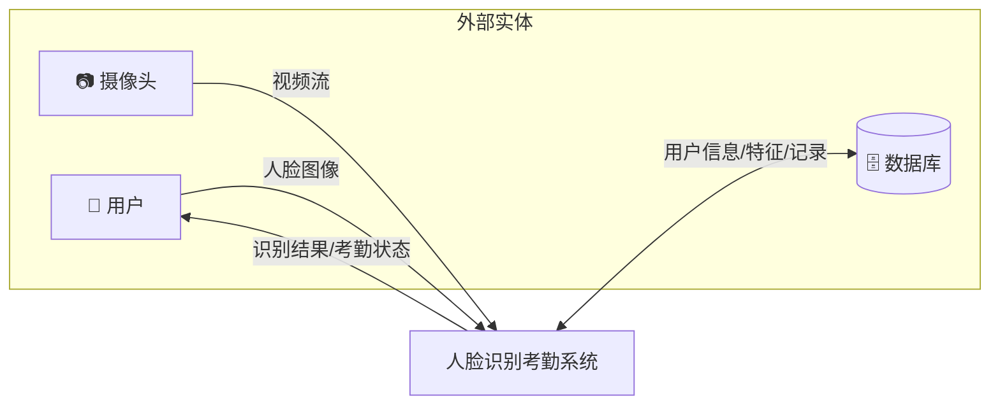
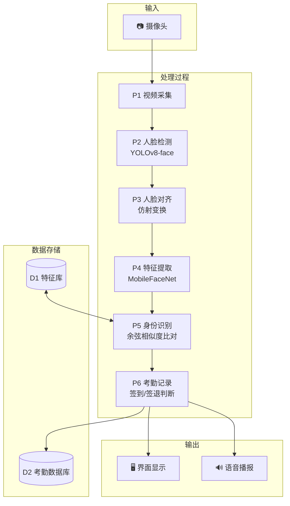
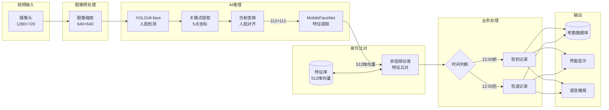
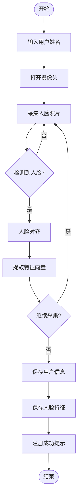
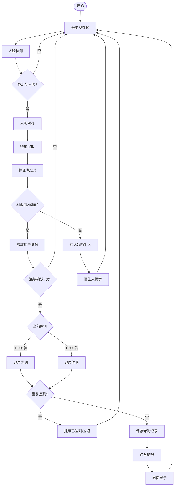

# 系统需求分析说明书

**项目名称**：基于人脸检测与识别的智能考勤系统

**项目编号**：1062

**编写人员**：陈亮

**编写日期**：2025年12月

---

## 目 录

1. 编制说明
   - 1.1 编制目的
   - 1.2 适用范围
   - 1.3 编制方法
   - 1.4 遵循的标准规范
     - 1.4.1 国家政策与文件
     - 1.4.2 地方政策与文件
     - 1.4.3 信息化标准规范
   - 1.5 术语与缩写词
2. 项目概况
   - 2.1 项目背景及分析
     - 2.1.1 行业背景
     - 2.1.2 技术背景
   - 2.2 项目总体目标
3. 假定和约束
4. 功能需求
   - 4.1 总体需求概述
     - 4.1.1 总体需求
     - 4.1.2 设计原则
     - 4.1.3 建设内容
     - 4.1.4 总体业务流程
   - 4.2 需求列表
   - 4.3 需求描述
     - 4.3.1 实时人脸检测
     - 4.3.2 人脸身份识别
     - 4.3.3 自动签到记录
     - 4.3.4 用户注册
     - 4.3.5 系统角色及权限
5. 性能需求
6. 安全需求
   - 6.1 安全需求概述
   - 6.2 网络安全
   - 6.3 系统安全
   - 6.4 数据安全
   - 6.5 应用安全
   - 6.6 隐私与权限管理
   - 6.7 管理安全
7. 附录
   - 7.1 硬件配置清单
   - 7.2 软件环境
   - 7.3 AI 模型信息

---

## 1. 编制说明

### 1.1 编制目的

本文档是"基于人脸检测与识别的智能考勤系统"的需求分析说明书，旨在明确系统的功能需求、性能需求和安全需求，为系统设计、开发和测试提供依据。通过本文档，开发团队能够准确理解用户需求，确保系统开发符合预期目标。

### 1.2 适用范围

本文档的预期读者包括：

1. 项目开发人员：了解系统功能边界和技术要求
2. 指导教师：评审需求的合理性和完整性
3. 测试人员：制定测试计划和用例
4. 项目验收人员：验证系统是否满足需求

本文档适用于基于 EC-A3588Q（RK3588）平台的人脸识别考勤系统开发项目。

### 1.3 编制方法

本文档采用以下方法进行编制：

1. **需求调研**：分析传统考勤方式的痛点和用户期望
2. **技术调研**：研究边缘 AI、人脸识别等技术的可行性
3. **原型验证**：通过快速原型验证核心功能的技术可行性
4. **迭代完善**：根据开发过程中的反馈持续更新需求

### 1.4 遵循的标准规范

#### 1.4.1 国家政策与文件

1. 《中华人民共和国网络安全法》（2017年6月1日施行）
2. 《中华人民共和国个人信息保护法》（2021年11月1日施行）
3. 《信息安全技术 个人信息安全规范》（GB/T 35273-2020）

#### 1.4.2 地方政策与文件

1. 广东省教育厅关于加强高校实践教学的指导意见
2. 学校项目工程实践课程教学大纲

#### 1.4.3 信息化标准规范

1. 《信息技术互连国际标准》（ISO/IEC 11801-95）
2. 《信息技术、软件包质量要求和测试》（GB/T 17544-1998）
3. 《软件工程标准分类法》（GB/T 15538-1995）
4. 《软件开发规范》（GB 8566-88）
5. 《计算机软件质量保证计划规范》（GB/T 12504-90）
6. 《人脸识别数据安全要求》（GB/T 41819-2022）

### 1.5 术语与缩写词

表1.1 术语与缩写词说明

| 术语/缩写词 | 说明 |
|-------------|------|
| NPU | Neural Processing Unit，神经网络处理单元 |
| RKNN | Rockchip Neural Network，瑞芯微神经网络模型格式 |
| FPS | Frames Per Second，每秒帧数 |
| YOLOv8 | You Only Look Once v8，实时目标检测算法 |
| MobileFaceNet | 轻量级人脸特征提取网络 |
| NMS | Non-Maximum Suppression，非极大值抑制 |
| RGA | Rockchip Graphics Accelerator，瑞芯微2D图形加速器 |
| SQLite | 轻量级嵌入式关系数据库 |
| Qt | 跨平台C++图形用户界面框架 |

---

## 2. 项目概况

### 2.1 项目背景及分析

#### 2.1.1 行业背景

随着人工智能技术的快速发展，人脸识别技术已广泛应用于安防、金融、教育等领域。传统的考勤方式存在以下问题：

1. **打卡机考勤**：需要携带工卡，存在代打卡风险
2. **指纹识别考勤**：接触式操作，存在卫生隐患，高峰期排队耗时
3. **手动签到**：效率低下，数据统计困难，容易造假

基于人脸识别的智能考勤系统能够实现非接触式、高效率的身份验证，有效解决上述问题。

#### 2.1.2 技术背景

边缘计算和嵌入式 AI 技术的成熟，使得在低功耗设备上部署深度学习模型成为可能。瑞芯微 RK3588 芯片集成了 6 TOPS 算力的 NPU，能够在边缘端高效运行人脸检测和识别模型，具有以下优势：

1. **隐私保护**：数据本地处理，无需上传云端
2. **低延迟**：无网络传输延迟，实时响应
3. **低成本**：无需购买云服务，一次性硬件投入
4. **高可靠**：不依赖网络，断网可用

### 2.2 项目总体目标

开发一套基于 EC-A3588Q（RK3588）平台的人脸识别智能考勤系统，实现实时人脸检测、识别和自动考勤功能。

具体目标如下：

1. **高效检测**：实现 30+ FPS 的实时人脸检测，支持多人同时检测
2. **准确识别**：人脸识别准确率 > 99%，支持 1000+ 人特征库
3. **自动考勤**：智能判断签到/签退，自动记录考勤数据
4. **友好界面**：提供现代化图形界面，操作简单直观
5. **数据管理**：支持用户管理、考勤查询、数据导出

---

## 3. 假定和约束

1. **硬件约束**：系统运行于 EC-A3588Q 开发板，需配备 USB 摄像头（分辨率 ≥ 720P）
2. **软件约束**：操作系统为 Ubuntu 22.04，需安装 RKNN 运行时库、OpenCV、Qt5 等依赖
3. **环境约束**：使用环境应保证充足光照（≥ 200 lux），避免强逆光
4. **用户约束**：用户需正面面对摄像头，距离 0.3-3 米，不佩戴墨镜或口罩
5. **网络约束**：核心功能离线可用，天气等辅助功能需联网
6. **存储约束**：系统存储空间 ≥ 4GB（模型文件约 50MB，数据库随用户数增长）

---

## 4. 功能需求

### 4.1 总体需求概述

#### 4.1.1 总体需求

系统需实现以下核心功能：

1. 实时采集摄像头视频流，检测画面中的人脸
2. 对检测到的人脸进行特征提取和身份识别
3. 根据识别结果自动记录考勤（签到/签退）
4. 提供用户注册、管理、查询等功能
5. 提供友好的图形用户界面

#### 4.1.2 设计原则

1. **实时性原则**：系统响应时间 < 100ms，保证用户体验流畅
2. **准确性原则**：识别准确率 > 99%，误识率 < 0.1%
3. **易用性原则**：界面简洁直观，无需培训即可上手
4. **可扩展原则**：模块化设计，便于后续功能扩展
5. **安全性原则**：人脸数据加密存储，保护用户隐私

#### 4.1.3 建设内容

表4.1 系统建设内容

| 序号 | 功能分类 | 具体描述 | 备注 |
|------|----------|----------|------|
| 1 | 人脸检测模块 | 基于 YOLOv8-face 的实时人脸检测 | 核心模块 |
| 2 | 人脸识别模块 | 基于 MobileFaceNet 的人脸特征提取与比对 | 核心模块 |
| 3 | 考勤管理模块 | 签到/签退记录、防重复、数据统计 | 核心模块 |
| 4 | 用户管理模块 | 用户注册、删除、人脸采集 | 核心模块 |
| 5 | 数据查询模块 | 考勤记录查询、导出 | 辅助模块 |
| 6 | 系统设置模块 | 参数配置、主题切换 | 辅助模块 |
| 7 | 语音播报模块 | 签到结果语音提示 | 辅助模块 |
| 8 | 天气显示模块 | 实时天气、空气质量 | 辅助模块 |

#### 4.1.4 总体业务流程

**（1）顶层数据流图（图4.1）**

**（2）0层数据流图（图4.2）**

**（3）1层数据流图（图4.3）**

**（4）用户注册流程图（图4.4）**

**（5）考勤识别流程图（图4.5）**

### 4.2 需求列表

表4.2 系统需求列表

| 需求编号 | 需求名称 | 优先级 |
|----------|----------|--------|
| REQ-001 | 实时人脸检测 | 高 |
| REQ-002 | 人脸特征提取 | 高 |
| REQ-003 | 人脸身份识别 | 高 |
| REQ-004 | 自动签到记录 | 高 |
| REQ-005 | 自动签退记录 | 高 |
| REQ-006 | 防重复签到 | 高 |
| REQ-007 | 用户注册 | 高 |
| REQ-008 | 用户删除 | 中 |
| REQ-009 | 考勤查询 | 中 |
| REQ-010 | 考勤导出 | 中 |
| REQ-011 | 语音播报 | 中 |
| REQ-012 | 主题切换 | 低 |
| REQ-013 | 天气显示 | 低 |
| REQ-014 | 陌生人检测 | 中 |

### 4.3 需求描述

#### 4.3.1 实时人脸检测（REQ-001）

表4.3 实时人脸检测需求表

| 项目 | 描述 |
|------|------|
| 涉及角色 | 系统用户 |
| 功能需求描述 | 系统实时采集摄像头视频流，使用 YOLOv8-face 模型检测画面中的人脸，输出人脸边界框和 5 个关键点（左眼、右眼、鼻尖、左嘴角、右嘴角） |
| 输入数据 | 摄像头视频帧（1280×720，30FPS） |
| 输出数据 | 人脸边界框坐标、5个关键点坐标、置信度 |
| 备注 | 支持同时检测多张人脸，检测延迟 < 30ms |

#### 4.3.2 人脸身份识别（REQ-003）

表4.4 人脸身份识别需求表

| 项目 | 描述 |
|------|------|
| 涉及角色 | 已注册用户 |
| 功能需求描述 | 对检测到的人脸进行特征提取，与特征库中的已注册用户进行比对，返回最匹配的用户身份或判定为陌生人 |
| 输入数据 | 对齐后的人脸图像（112×112） |
| 输出数据 | 用户ID、姓名、相似度；或"陌生人"标识 |
| 备注 | 相似度阈值默认 0.5，可在设置中调整 |

#### 4.3.3 自动签到记录（REQ-004）

表4.5 自动签到记录需求表

| 项目 | 描述 |
|------|------|
| 涉及角色 | 已注册用户 |
| 功能需求描述 | 当识别到已注册用户且当前时间在 12:00 之前时，自动记录签到时间；需连续 5 帧识别成功才触发签到，避免误识别 |
| 输入数据 | 用户ID、当前时间 |
| 输出数据 | 考勤记录（用户ID、签到时间、类型="签到"） |
| 备注 | 签到成功后播放语音提示 |

#### 4.3.4 用户注册（REQ-007）

表4.6 用户注册需求表

| 项目 | 描述 |
|------|------|
| 涉及角色 | 管理员 |
| 功能需求描述 | 管理员输入用户姓名，通过摄像头采集用户人脸照片，提取特征向量并保存到数据库 |
| 输入数据 | 用户姓名、人脸照片（建议采集多张） |
| 输出数据 | 用户记录、人脸特征记录 |
| 备注 | 支持采集多张照片提高识别率 |

#### 4.3.5 系统角色及权限

表4.7 系统角色权限表

| 角色 | 权限描述 |
|------|----------|
| 普通用户 | 人脸识别签到/签退、查看个人考勤记录 |
| 管理员 | 用户注册/删除、查看所有考勤记录、系统设置、数据导出 |

---

## 5. 性能需求

系统应满足以下性能指标：

1. **实时性要求**
   - 视频帧率：≥ 30 FPS
   - 人脸检测延迟：< 30ms
   - 人脸识别延迟：< 50ms
   - 界面响应时间：< 100ms

2. **准确性要求**
   - 人脸检测率：≥ 98%（正常光照、正脸）
   - 人脸识别准确率：≥ 99%（注册用户）
   - 误识率：< 0.1%
   - 陌生人拒识率：≥ 99%

3. **容量要求**
   - 支持注册用户数：≥ 1000 人
   - 支持考勤记录数：≥ 100 万条
   - 单用户特征数：≥ 3 个

4. **稳定性要求**
   - 连续运行时间：≥ 24 小时无崩溃
   - 内存泄漏：无
   - CPU 占用率：< 50%

---

## 6. 安全需求

### 6.1 安全需求概述

人脸识别系统涉及用户生物特征数据，属于敏感个人信息，需严格遵守《个人信息保护法》和《人脸识别数据安全要求》，确保数据采集、存储、使用的全流程安全。

### 6.2 网络安全

1. 核心功能（人脸识别、考勤记录）离线运行，不依赖网络
2. 天气等联网功能使用 HTTPS 加密通信
3. 系统不主动上传任何用户数据到外部服务器

### 6.3 系统安全

1. 操作系统保持更新，及时修复安全漏洞
2. 关闭不必要的系统服务和端口
3. 设置系统用户权限，限制非授权访问

### 6.4 数据安全

1. 人脸特征向量以二进制格式存储，不存储原始人脸照片
2. 数据库文件存储在本地，不上传云端
3. 定期备份数据库，防止数据丢失
4. 用户删除时同步删除所有关联的特征数据

### 6.5 应用安全

1. 管理功能需输入密码验证
2. 识别阈值可配置，防止过低阈值导致误识别
3. 防重复签到机制，避免恶意刷考勤

### 6.6 隐私与权限管理

1. 遵循"最小必要"原则，仅采集必要的人脸数据
2. 明确告知用户数据用途，获取用户同意
3. 提供用户数据删除功能，支持"被遗忘权"
4. 不将人脸数据用于考勤以外的其他用途

### 6.7 管理安全

1. 制定数据安全管理制度
2. 定期审计系统访问日志
3. 对管理人员进行安全培训

---

## 7. 附录

### 7.1 硬件配置清单

表7.1 硬件配置清单

| 设备 | 型号 | 数量 | 用途 |
|------|------|------|------|
| 开发板 | EC-A3588Q（RK3588） | 1 | 系统运行平台 |
| 摄像头 | 罗技 C720 | 1 | 视频采集 |
| 显示器 | 24寸 1080P | 1 | 界面显示 |
| 电源适配器 | 12V/3A | 1 | 供电 |

### 7.2 软件环境

表7.2 软件环境配置

| 软件 | 版本 | 用途 |
|------|------|------|
| Ubuntu | 22.04 | 操作系统 |
| RKNN Runtime | 2.3.0 | NPU 推理 |
| OpenCV | 4.5+ | 图像处理 |
| Qt | 5.15 | GUI 框架 |
| SQLite | 3.x | 数据库 |

### 7.3 AI 模型信息

表7.3 AI 模型信息

| 模型 | 用途 | 输入 | 输出 | 大小 |
|------|------|------|------|------|
| yolov8n-face.rknn | 人脸检测 | 640×640 RGB | 边界框+关键点 | ~10MB |
| w600k_mbf.rknn | 特征提取 | 112×112 RGB | 512维向量 | ~5MB |

---

