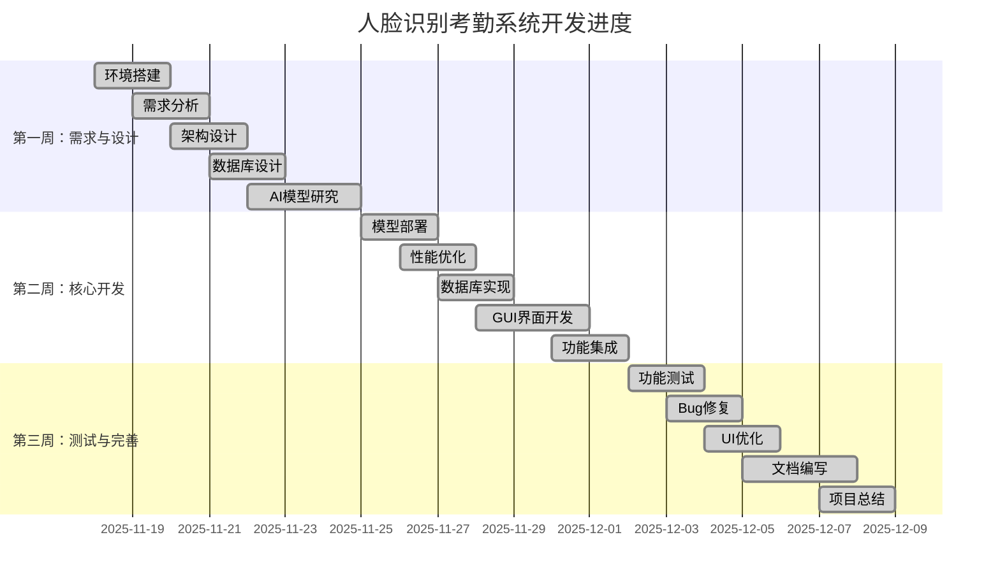

# 项目实施计划说明书

**项目名称**：基于人脸检测与识别的智能考勤系统

**项目编号**：1062

**编写人员**：陈亮

**编写日期**：2025年12月

---

## 目 录

1. 项目简介
2. 项目团队人员信息
   - 2.1 指导教师团队信息
   - 2.2 学生团队人员信息
3. 工作任务的分解与分工说明
   - 3.1 项目小组
   - 3.2 工作任务分解与分工
   - 3.3 项目文档编制任务分工
4. 项目开发进度

---

## 1. 项目简介

本项目旨在开发一套基于 EC-A3588Q（RK3588）平台的人脸识别智能考勤系统。系统采用 YOLOv8n-face 进行人脸检测，MobileFaceNet 进行人脸特征提取，充分利用 RK3588 芯片的 NPU 硬件加速能力，实现 30+ FPS 的实时人脸识别和自动考勤功能。

系统主要功能包括：
1. 实时人脸检测与识别
2. 自动签到/签退记录
3. 用户注册与管理
4. 考勤数据查询与导出
5. 语音播报与天气显示

系统采用 C++ 语言开发，使用 Qt5 构建图形用户界面，SQLite 作为本地数据库，具有离线可用、隐私保护、低延迟等优点。

---

## 2. 项目团队人员信息

### 2.1 指导教师团队信息

本项目指导教师团队人员包括：

| 序号 | 姓名 | 职称 | 职责 |
|------|------|------|------|
| 1 | （指导教师姓名） | （职称） | 项目指导、技术咨询、进度监督 |

### 2.2 学生团队人员信息

本项目学生团队人员信息如表1所示：

表1 本项目学生团队人员信息表

| 学号 | 姓名 | 专业 | 班级 |
|------|------|------|------|
| 20220070120 | 陈亮 | 物联网工程 | 22物联网工程1班 |

---

## 3. 工作任务的分解与分工说明

### 3.1 项目小组

由于本项目为个人独立完成，一人承担所有角色职责：

| 角色 | 负责人 |
|------|--------|
| 项目经理 | 陈亮 |
| 规划与分析小组 | 陈亮 |
| 项目设计小组 | 陈亮 |
| 代码实现小组 | 陈亮 |
| 项目测试小组 | 陈亮 |
| 项目维护小组 | 陈亮 |
| 推广应用小组 | 陈亮 |

### 3.2 工作任务分解与分工

**（1）项目经理**

| 负责人 | 工作职责 |
|--------|----------|
| 陈亮 | 负责项目整体规划、进度控制、资源协调、风险管理、质量保证 |

**（2）规划与分析**

| 负责人 | 工作职责 |
|--------|----------|
| 陈亮 | 需求调研、可行性分析、技术选型、系统需求分析、编写需求文档 |

**（3）项目设计**

| 负责人 | 工作职责 |
|--------|----------|
| 陈亮 | 系统架构设计、数据库设计、接口设计、UI设计、编写设计文档 |

**（4）代码实现**

| 负责人 | 工作职责 |
|--------|----------|
| 陈亮 | AI模型部署、核心算法开发、数据库模块开发、GUI界面开发、功能集成 |

**（5）项目测试**

| 负责人 | 工作职责 |
|--------|----------|
| 陈亮 | 单元测试、功能测试、性能测试、稳定性测试、Bug修复、编写测试报告 |

**（6）项目维护**

| 负责人 | 工作职责 |
|--------|----------|
| 陈亮 | 系统优化、问题修复、版本管理、代码维护 |

**（7）推广应用**

| 负责人 | 工作职责 |
|--------|----------|
| 陈亮 | 编写用户手册、系统部署、使用培训、推广方案制定 |

### 3.3 项目文档编制任务分工

表2 项目文档编制任务分工表

| 文档名称 | 负责人 | 完成时间 |
|----------|--------|----------|
| 系统需求分析说明书 | 陈亮 | 第1周 |
| 系统设计说明书 | 陈亮 | 第1周 |
| 项目实施计划说明书 | 陈亮 | 第1周 |
| 系统实现说明书 | 陈亮 | 第2周 |
| 系统测试说明书 | 陈亮 | 第3周 |
| 系统使用说明书 | 陈亮 | 第3周 |
| 系统推广方案说明书 | 陈亮 | 第3周 |
| 项目总结汇报书 | 陈亮 | 第3周 |
| 项目工程实践报告 | 陈亮 | 第3周 |
| 个人总结 | 陈亮 | 第3周 |
| 工作周报 | 陈亮 | 每周 |
| 成果登记表 | 陈亮 | 第3周 |

---

## 4. 项目开发进度

表3 项目开发进度表

| 时间 | 项目阶段 | 主要工作内容 |
|------|----------|--------------|
| 第1周（11.18-11.24） | 需求分析与设计 | 环境搭建、需求分析、架构设计、数据库设计、AI模型研究 |
| 第2周（11.25-12.01） | 核心功能开发 | 模型部署、性能优化、数据库实现、GUI开发、功能集成 |
| 第3周（12.02-12.08） | 测试与完善 | 功能测试、Bug修复、UI优化、文档编写、项目总结 |

本项目开发对应的项目计划图（甘特图）如图1所示。

**图1 项目开发进度甘特图**

---

