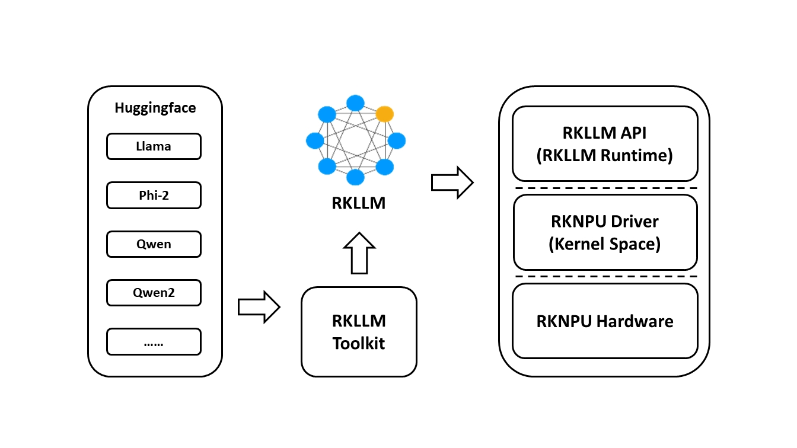

<div align="center">

[English](./README.md) | [简体中文](./README_zh.md)

# RK3588 NPU Face Recognition System

**基于 Rockchip NPU 的高性能嵌入式人脸识别与考勤解决方案**

[](https://en.cppreference.com/w/cpp/17)
[](http://www.rock-chips.com/)
[](https://www.qt.io/)
[](LICENSE)
[](https://github.com/airockchip/rknn-toolkit2)

[核心特性](#核心特性) • [技术栈](#技术栈) • [快速开始](#快速开始) • [文档中心](#文档中心)

</div>

---

## 项目简介

本项目是专为 Rockchip RK3588 平台打造的高性能人脸识别考勤系统。不仅通过深度整合 RKNN 硬件加速推理、RGA 图形加速引擎以及 V4L2 零拷贝采集技术实现了极致的性能，更**开创性地实现了"端云双引擎"的智能分析功能**。

系统不再仅仅记录打卡，而是集成了 **本地离线大模型 (On-Device LLM)** 与 **云端大模型 API**，能够通过自然语言对话，深度分析考勤规律、诊断异常行为、自动生成分析报表。它将传统的硬件终端升级为具备逻辑思维能力的智能管理 Agent，且**完全支持离线闭环运行**，确保数据隐私安全。

---

## 核心特性

### 🤖 混合双引擎 AI 助手 (Dual-Engine AI Agent)

<div align="center">

<p><em>HuggingFace 大模型转换为 RKLLM 格式的完整流程</em></p>
</div>

- **端侧大模型 (Local LLM)**: 深度集成 **RKLLM**，在 RK3588 本地 NPU 上运行 2B/7B 级大模型（如 Qwen-2B）。
  - **离线运行**: 无需联网，数据完全不出域，隐私性极高。
  - **NPU 加速**: 充分利用 NPU 算力，推理速度快（~10 token/s），首字延迟 < 200ms。
- **云端大模型 (Cloud LLM)**: 无缝对接云端标准大模型 API，支持更复杂的通识类问答。
- **OpenAI 兼容自定义大模型接口**: 当设置 `LLAMA_CPP_SERVER_URL` 后，远端路径会自动从腾讯云切换到 OpenAI 兼容 `/v1/chat/completions`。
- **一键切换**: 独创的 NPU 资源调度机制，支持在"人脸识别模式"和"LLM分析模式"间流畅切换。

### 📊 全量数据智能诊断
- **多维分析**: 支持对“今日 / 近 7 日 / 近 30 日”全量考勤数据进行深度诊断。
- **智能洞察**: 即时识别潜在的考勤异常规律（如长期迟到、早退趋势），并给出针对性的管理建议。
- **流式报告**: 无论是本地还是云端，均支持打字机式的流式响应，体验丝滑。

### 🚀 性能优化 (Extreme Performance)
- **NPU 资源动态调度**: 实现了 RKNN (视觉) 和 RKLLM (语言) 的**互斥资源管理策略**，解决 NPU 竞争死锁问题，确保两者均能在独占模式下全速运行。
- **NPU 硬件加速**: 集成 RKNN Runtime，实现 YOLOv8-face 检测与 FaceNet 识别的全流程 NPU 卸载。
- **RGA 图形加速**: 利用 Rockchip RGA 2D 硬件引擎处理图像缩放、翻转与格式转换 (YUV -> RGB)。
- **多线程流水线**: 采用 5 级流水线设计，最大化并行处理能力。

### 🛡️ 业务功能完备
- **灵活交互模式**: 提供基于 Qt5 的现代化触控 GUI 界面。
- **高性能数据库**: 内置 SQLite3，支持百万级记录的秒级查询与写入。
- **高健壮性设计**: 包含摄像头热插拔自动恢复机制、人脸特征库实时同步与动态加载。

---

## 技术栈

| 模块 | 技术选型 | 说明 |
| :--- | :--- | :--- |
| **编程语言** | **C++17** | 核心逻辑开发，充分利用标准库新特性 |
| **本地 LLM** | **RKLLM Runtime** | **核心亮点：RK3588 NPU 离线大模型推理 (Qwen-2B)** |
| **云端 LLM** | Cloud LLM API | 备用在线大模型引擎 (SSE 流式协议) |
| **UI 框架** | Qt 5.15+ | 现代化图形用户界面，支持动态主题切换 |
| **深度学习** | RKNN Toolkit2 | NPU 视觉模型推理 (YOLOv8, FaceNet) |
| **计算机视觉** | OpenCV 4.5+ | 图像处理与算法辅助 |
| **硬件加速** | Rockchip RGA | 2D 硬件加速引擎 |
| **数据采集** | V4L2 | Linux 视频驱动接口 (mmap 零拷贝模式) |
| **数据库** | SQLite3 | 嵌入式本地存储，DAO 架构设计 |
| **并发模型** | C++ Thread + Qt Signal | 多线程流水线与异步事件驱动 |

---

## 快速开始

### 1. 环境要求
确保硬件为 RK3588 系列开发板（如 Orange Pi 5, Rock 5B），系统已安装基础构建工具及支持 C++17 的编译器：

```bash
sudo apt update
sudo apt install cmake build-essential libopencv-dev qt5-default libsqlite3-dev
```

### 2. 构建与运行
```bash
cd C++/face_recognition_cap
./build.sh

# 启动 GUI 模式
./build/build_linux_aarch64/face_recognition_cap
```

### 3. 配置大模型后端

#### 本地 RKLLM

```bash
export LOCAL_LLM_MODEL_PATH=/path/to/your_model.rkllm
```

#### 腾讯云 LKE

```bash
export TENCENT_APP_KEY=your_app_key
export TENCENT_SECRET_ID=your_secret_id
export TENCENT_SECRET_KEY=your_secret_key
```

#### OpenAI 兼容自定义远端接口

```bash
export LLAMA_CPP_SERVER_URL=http://127.0.0.1:8080
export LLAMA_CPP_SERVER_MODEL=gpt-4o-mini
export LLAMA_CPP_SERVER_API_KEY=sk-your-key
```

说明：

- `LLAMA_CPP_SERVER_URL` 只写基地址，代码会自动补 `/v1/chat/completions`
- 变量名沿用历史 `LLAMA_CPP_*`，但并不要求后端必须是 llama.cpp
- 只要兼容 OpenAI Chat Completions，就可以作为远端 Agent 接口
- 当 `LLAMA_CPP_SERVER_URL` 非空时，远端请求将不再走腾讯云

---

## 文档中心

*   [快速入门指南](C++/face_recognition_cap/docs/用户文档/快速开始.md) - 环境搭建与详细编译步骤。
*   [架构设计文档](C++/face_recognition_cap/docs/开发文档/README.md) - 系统架构、流水线设计与核心模块说明。
*   [API 接口文档](C++/face_recognition_cap/docs/开发文档/API文档.md) - 二次开发与集成接口。
*   [用户使用手册](C++/face_recognition_cap/docs/用户文档/用户使用手册.md) - GUI 功能操作指南。
*   [Agent 模块说明](C++/face_recognition_cap/docs/开发文档/Agent模块说明.md) - 当前 Agent 架构、工具集与 OpenAI 兼容远端接入说明。
*   [OpenAI 兼容接口接入说明](C++/face_recognition_cap/docs/开发文档/OpenAI兼容接口接入说明.md) - 环境变量与自定义大模型接口配置方法。

---

## 使用许可与免责声明

### 1. 使用条款
本项目及其源代码**仅供学习、研究与个人交流使用**。在满足以下条件的前提下，您可以自由获取和修改代码：
- **严禁商用**：不得将本项目或其修改版本用于任何形式的商业产品、收费服务或盈利活动。
- **保留声明**：在分发或传播代码时，必须保留原始的版权声明和本使用许可。

### 2. 免责声明
本程序按“原样”提供，不附带任何形式的明示或暗示保证。作者不保证程序的稳定性或安全性，因使用本程序产生的任何损失，作者概不负责。

---

## 版权声明

Copyright © 2025 **Edge2-NPU Project**. All Rights Reserved.
